# Architecture

## Overview

```mermaid
sequenceDiagram
    participant Buyer
    participant UI as Frontend (chat UI)
    participant API as /api/chat
    participant Agent as agent.js (Claude, tool use)
    participant Tools as tools.js
    participant Guard as guardrails.js
    participant Audit as auditLog.js (append-only)
    participant RZP as Razorpay TEST API

    Buyer->>UI: "earbuds under 5000"
    UI->>API: POST sessionId + message
    API->>Agent: handleUserMessage()
    Agent->>Agent: Claude decides to call search_catalog
    Agent->>Tools: executeTool("search_catalog", ...)
    Tools->>Guard: assertToolAllowed()
    Tools->>Audit: record(success)
    Tools-->>Agent: matching products
    Agent-->>API: "I found the Aurora Earbuds at ₹3,499..."
    API-->>UI: reply + cart snapshot
    UI-->>Buyer: renders message + live audit panel

    Note over Buyer,RZP: ... cart building continues ...

    Buyer->>UI: "checkout, name Aisha, +919876543210"
    UI->>API: POST message
    API->>Agent: handleUserMessage()
    Agent->>Tools: summarize_order()
    Tools->>Guard: assertCartNotEmpty + assertOrderValueBounded
    Tools-->>Agent: order summary
    Agent-->>Buyer: "Here's your order — 1x Aurora Earbuds, ₹3,499. Confirm?"
    Buyer->>UI: "yes"
    UI->>API: POST message
    Agent->>Tools: create_checkout(confirmed=true, reasoning=...)
    Tools->>Guard: assertCheckoutConfirmed + hasSummarizedOrder check
    Tools->>RZP: paymentLink.create()
    RZP-->>Tools: payment link + short_url
    Tools->>Audit: record(success, result, reasoning)
    Tools-->>Agent: pay URL
    Agent-->>Buyer: "Here's your payment link: ..."

    RZP--)API: webhook: payment_link.paid
    API->>API: verifyWebhookSignature()
    API->>Audit: record(webhook received)
```

## Delegated authority: the two ways checkout gets authorised

Everything hinges on one question — *who said this agent could spend this money?*
There are exactly two answers, and `assertCheckoutAuthorized` in
`guardrails.js` is the single place either is accepted.

| Mode | Authority | Enforced by |
|---|---|---|
| **Attended** | A human saw a `summarize_order` result and explicitly agreed | `confirmed === true` **and** `session.hasSummarizedOrder` |
| **Unattended** | A signed spend mandate issued before the run began | Signature, expiry, per-order cap, remaining budget, transaction count, category scope — all re-checked on *every* spend |

Both paths hit `MAX_ORDER_VALUE_PAISE` — the merchant's own ceiling — first and
unconditionally. **Effective authority is the intersection of merchant policy
and buyer grant.** A mandate can only narrow what the agent may do; it can never
widen it past what the merchant configured. A mandate asking for ₹9,00,000 on a
₹50,000 merchant cap is still bounded at ₹50,000.

### Why the mandate is signed

The agent holds the mandate. If it were a plain object, an agent (or a bug, or a
prompt injection) could raise its own ceiling by editing a field. Every granted
field — budget, per-order cap, categories, transaction count, expiry, subject —
is covered by an HMAC-SHA256 signature checked on each spend, so tampering
downgrades to a `MANDATE_SIGNATURE_INVALID` rejection rather than a bigger
purchase.

Two deliberate design choices worth calling out:

- **Fail-closed on `maxTransactions: 0`.** Zero authorised means zero, not
  "unlimited". Treating the most restrictive possible grant as the most
  permissive one is exactly the kind of inversion that turns a safety control
  into a liability, so there is no `> 0` escape hatch on that check.
- **Spend is booked after the payment link exists**, not before. A failed
  Razorpay call never burns mandate budget.

### What this is *not*

The mandate is a server-side HMAC. It proves the grant wasn't altered after
*this server* issued it. It is not a buyer-held credential, and it does not
travel across merchants — see
[Known limitations](#known-limitations--next-steps).

## Why Payment Links, not embedded Checkout.js

A conversational agent doesn't have a page to embed a JS checkout widget
into — the "UI" is a chat bubble. Razorpay's **Payment Links API** fits that
shape exactly: the agent calls one API to get a hosted, shareable pay-now URL,
sends it as a normal chat message, and the buyer completes payment on
Razorpay's own hosted page (which also means Signet never touches card data).
Confirmation flows back via **webhook** (`payment_link.paid`), which is how a
real agentic-commerce integration would want it — asynchronous, signed, and
decoupled from the chat request/response cycle.

## Bounded operations

All guardrails live in one file, `backend/src/agent/guardrails.js`, deliberately
decoupled from the LLM and from Express — it only ever sees structured
`(toolName, input)` pairs and either returns normally or throws
`GuardrailViolation`. That means:

1. **Tool whitelist.** `ALLOWED_TOOLS` is a fixed `Set` of 8 names. Anything
   else — including a name an LLM might hallucinate — is rejected before any
   side effect happens.
2. **Quantity cap.** `MAX_ITEM_QUANTITY` (env-configurable, default 10) blocks
   a single line item from growing unbounded, and is re-checked on the
   *cumulative* quantity when adding to an existing line, not just the delta.
3. **Order value cap.** `MAX_ORDER_VALUE_INR` (default ₹50,000) blocks
   `summarize_order` and `create_checkout` from proceeding on any cart whose
   total exceeds it — checked twice (at summarize time and again at checkout
   time, in case the cart changed in between).
4. **Confirmation gate.** `create_checkout` requires `confirmed === true`
   (strict boolean, not any truthy value) **and** a session-level
   `hasSummarizedOrder` flag that is only set by a successful `summarize_order`
   call and is invalidated the moment the cart changes afterward (see
   `tools.js`, `add_to_cart`/`remove_from_cart` resetting
   `session.hasSummarizedOrder = false`). This closes the gap where an agent
   summarizes an order, the user changes their mind and swaps an item, and the
   agent tries to check out against the stale summary.

All four are unit-tested in `backend/test/guardrails.test.js` (pure guardrail
logic) and `backend/test/tools.test.js` (guardrails wired into the actual tool
executor and session state).

Guardrails fail **closed**: any ambiguous or unexpected state is treated as
"reject", never "allow".

## Explainability

Two mechanisms work together:

- **In the moment:** the system prompt requires the agent to narrate what it
  did and why after every tool call, in its own words, in the chat itself.
  `create_checkout` additionally requires a `reasoning` field the model must
  fill in explaining why checkout is correct *right now* — that string is
  persisted to the audit log alongside the tool call.
- **In the UI:** `/api/chat` returns a `toolCalls` array alongside the reply —
  every tool the agent ran this turn, with its outcome. The chat renders that
  as tool chips above each answer, product cards for `search_catalog` results,
  and an explicit amber block for anything a guardrail rejected. The
  explainability is in the buyer's line of sight, not buried in a debug view.
- **After the fact:** `GET /api/audit/:sessionId` (and the live panel in the
  UI) returns the full, timestamped list of every tool call in a session —
  inputs, outcome (`success` / `rejected` / `error`), and for rejections, the
  specific guardrail `code` that fired. The panel polls this endpoint *during*
  a turn, so calls appear as they execute rather than in one batch at the end.
  A reviewer can reconstruct exactly what the agent considered doing, what it
  was allowed to do, and what it actually did, without re-reading chat
  transcripts.

## Audit trail — tamper-evident, not just append-only

`backend/src/agent/auditLog.js` appends one JSON line per tool call to
`backend/data/audit.jsonl` via `fs.appendFileSync`, and exposes no update or
delete method.

That alone is a weak guarantee, and it's worth being honest about why:
`audit.jsonl` is a plain text file, and anyone with an editor can rewrite it.
"The module has no delete method" says nothing about what a person — or another
process — can do to the file.

So each entry also carries `prevHash` (the hash of the entry before it) and its
own `hash` over `(seq, ts, prevHash, payload)`, hashed under a canonical
key-sorted serialization so key order can't affect the result. This makes the
log **tamper-evident**:

- Edit any field of any historical record → that record's own hash no longer
  matches → `CONTENT_ALTERED`, naming the record.
- Recompute that record's hash to cover your tracks → the *next* record's
  `prevHash` no longer matches → `BROKEN_LINK`.
- Delete or reorder a record → same broken link.

`GET /api/audit/verify` recomputes the chain from genesis and returns the first
break. It's wired to a **Verify chain** button in the UI, so the claim is
checkable in ten seconds by anyone, rather than taken on trust. Every entry carries: timestamp, session id, tool
name, input, outcome, and (for successes) the result or (for
rejections/errors) a guardrail code and message. The webhook handler writes
to the same log, so a full order's lifecycle — cart building, checkout,
payment confirmation — is reconstructable from one file.

## Graceful failure handling

Three layers, each catching a different failure class:

1. **Guardrail rejections** (`GuardrailViolation`) are caught inside
   `executeTool` itself and turned into a structured `{ error, code }` object
   that gets fed back to Claude as a tool result — the agent explains the
   rejection to the user in plain language and suggests a next step, rather
   than the request failing.
2. **External API failures** (Razorpay down, bad test keys, Anthropic rate
   limited) are caught at their call sites (`agent.js`'s `messages.create`
   call, `tools.js`'s Razorpay calls via the same try/catch as guardrails) and
   surfaced as a plain-language chat reply, never an unhandled rejection.
3. **Anything else** is caught by a last-resort try/catch around the whole
   `/api/chat` handler in `routes/chat.js`, which always responds `200` with a
   safe, non-technical message — a buyer never sees a stack trace, and (per
   the audit log) nothing is charged if the failure happened before
   `create_checkout` ran.

Misconfiguration is treated as its own failure class rather than lumped in
with (3): a missing `ANTHROPIC_API_KEY` is detected before the agent loop
starts and returns a message naming the exact variable to set, and
`/api/health` reports which credentials are present so the UI can show a setup
banner on load instead of failing part-way through a conversation.

## Known limitations / next steps

Scoped deliberately narrow for a buildathon submission:

- **Session store is in-memory** (`sessionStore.js`) — restarting the server
  loses in-flight carts. A production version swaps this for Redis/Postgres
  without changing `agent.js`'s interface.
- **Webhook handler acknowledges but doesn't yet persist** payment
  confirmation back into session/order state (it's logged to the audit trail,
  which is enough to demo the signed-callback path, but a real system would
  update an orders table keyed by `reference_id`).
- **Single currency (INR), single conversational flow.** Multi-currency and
  e.g. a "modify an existing paid order" flow are out of scope here.
- **No authentication on `/api/audit/:sessionId`** — fine for a local demo,
  not for a multi-tenant deployment.
- **Mandates are server-signed, not buyer-held.** The natural next step is a
  buyer-held keypair so the grant travels with the buyer across merchants, and
  the merchant verifies a signature it never could have forged — which is the
  direction RBI-style delegated payment mandates and the emerging agent-payment
  protocols (AP2, ACP) point in. The guardrail interface wouldn't change; only
  `mandate.verifySignature` would.
- **The hash chain is local and unanchored.** It detects edits, but someone who
  can rewrite the *entire* file can re-chain it end to end. Anchoring the head
  periodically (a countersigned receipt, or simply shipping heads off-box) is
  what closes that gap.
- **Recovery is merchant-initiated and manual.** `listAbandoned` scans in-memory
  sessions on request; a production version would run on a schedule against
  persisted sessions and respect contact-consent rules before sending anything.
- **The audit log is read by re-parsing the whole file** on each poll, and
  `record()` re-reads it to compute the next sequence number. Fine at demo scale
  (one file, a few hundred lines); a real deployment would keep the head and
  sequence in memory or write to an append-only table instead.
